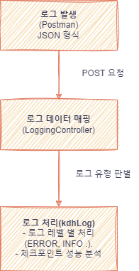

<!-- logo -->
# Log Server 프로젝트
   
  

 

## 📜 프로젝트 개요
logserver는 애플리케이션의 로그를 효과적으로 수집, 관리, 분석하는 로그 서버입니다.
Spring Boot 기반으로 REST API를 제공하여, 다양한 애플리케이션에서 발생하는 로그를 중앙 집중적으로 수집할 수 있도록 설계되었습니다.

 

## **📊 로그 수집 프레임워크**
 

 

1️⃣ 클라이언트는 `POST /add_log` API를 호출하며 로그 데이터를 전송

2️⃣ 서버는 JSON 데이터를 `LogRecord.java` 객체로 변환

3️⃣ `LoggingController.java`에서 로그 유형을 판별하여 `KdhLog.java`에서 적절한 로깅 수행

4️⃣ 서버에서 로깅 완료 후 `LogResponse` 객체를 JSON 형태로 클라이언트에게 반환

 

 

## 📌 요구사항 분석
### ✅ 기능 요구사항

- 다양한 로그 레벨 (ERROR, WARN, INFO, DEBUG, TRACE) 지원
- API를 통한 로그 수집 (`POST /add_log`)
- JSON 데이터를 통해 로그 정보 전달
- 체크포인트 기반 성능 측정 기능 설계

### 🔧 기술 요구사항

- Java 11 
- Spring Boot 2.x
- Logback 로깅 프레임워크 사용
- JSON 직렬화/역직렬화 라이브러리 사용

 

 

## 🔄 데이터 프로세스

1️⃣ 로그 요청 데이터 (LogRecord)

      {
        "Location": "com.example.Main",
        "Message": "Service started",
        "LogType": "INFO",
        "Checkpoint": "start",
        "VarName": "executionTime",
        "VarValue": "123ms"
      }

2️⃣ 로그 처리 흐름
      [LoggingController] → LogRecord 변환 → KdhLog 메서드 호출 → 로그 기록

3️⃣ API 응답 데이터 (LogResponse)
      {
        "Code": 200,
        "Message": "Log successfully recorded"
      }

 

## 🏗 프로젝트 구조 분석
 

      └─src
          └─main
              ├─java
              │  └─kdh
              │      └─log_server
              │              KdhLog.java
              │              LoggingController.java
              │              LogRecord.java
              │              LogResponse.java
              │              LogServerApplication.java
              │              LogType.java
              │
              └─resources
                      application.yml.sample
                      logback.xml.sample

 

### 📂 주요 디렉토리 및 클래스 설명

**1️⃣ `kdh.log_server` (주요 로직이 포함된 패키지)**

- **`KdhLog.java`** → 로그 기록을 담당하는 핵심 클래스
- **`LoggingController.java`** → REST API 엔드포인트 제공
- **`LogRecord.java`** → JSON 요청을 매핑하는 데이터 모델
- **`LogResponse.java`** → API 응답을 담당하는 데이터 모델
- **`LogType.java`** → 로그 유형을 정의하는 enum
- **`LogServerApplication.java`** → Spring Boot 실행 엔트리포인트

**2️⃣ `resources` (설정 파일)**

- **`application.yml.sample`** → Spring Boot 애플리케이션 설정 예제
- **`logback.xml.sample`** → Logback 로깅 설정 예제

 

 
## 🤔 기술적 이슈와 해결 과정

 
